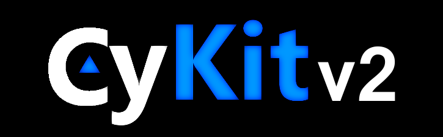
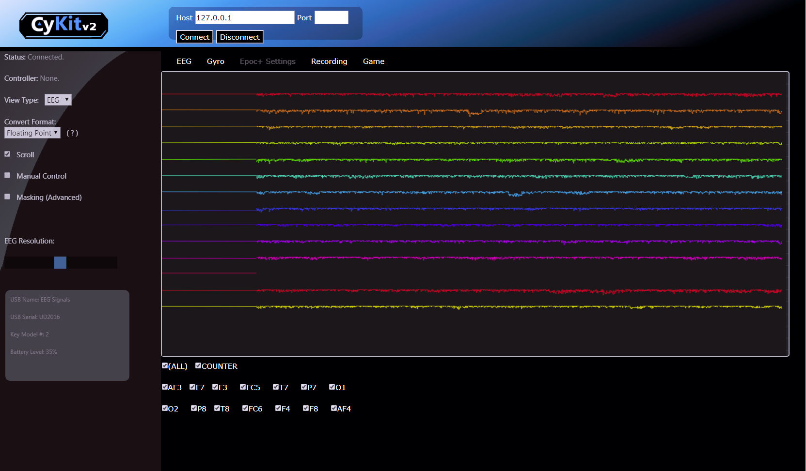
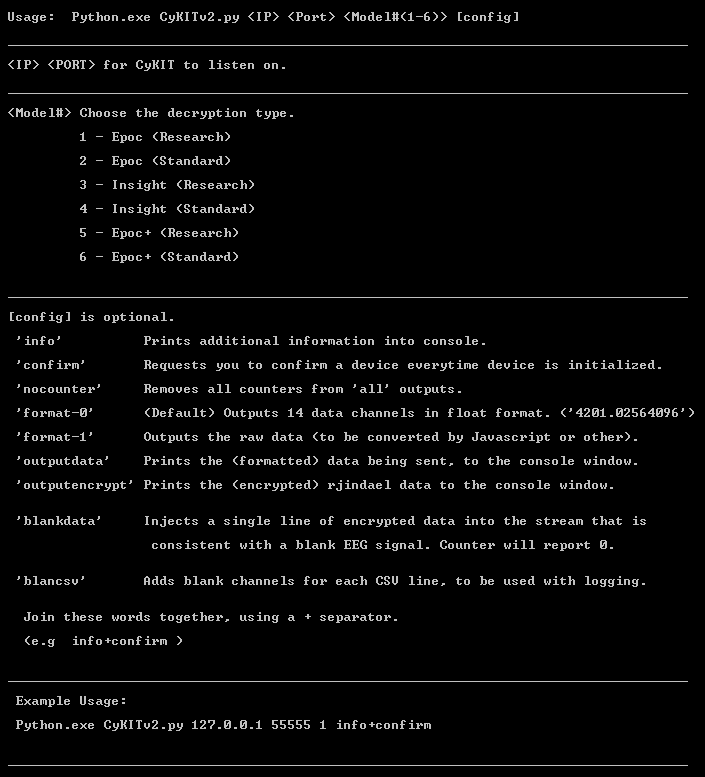

Updated Version (2017.12.23)

Chat Discussion:
https://discordapp.com/invite/gTYNWc7  
(Do not need discord app, just click for browser chat)

 
CyKit 2.0 (2017.12) for Python 2.7.6 (Windows)

Python Data Controller for Neural EEG headsets.

Description
-----------
Streams EEG data to a browser for data handling.
Works with Chrome and Firefox.

  
 

Dependencies
------------
* pywinusb 0.4.2 --- https://pypi.python.org/pypi/pywinusb/   
* pycrypto 2.6.1 --- https://pypi.python.org/pypi/pycrypto/2.6.1

Installation
------------
* Install Python 2.7.6
* Install pycrypto
* Extract pywinusb-0.4.2
* Copy pywinusb/ folder to Python27\Lib\site-packages\

Usage
-----

 
example 1.
python.exe CyKITv2.py 127.0.0.1 18675 2

example 2.
python.exe CyKITv2.py 127.0.0.1 15309 4 info

example 3.
python.exe CyKITv2.py 127.0.0.1 12991 6 info+confirm

* Open a browser. (Firefox/Chrome)
* Open Web Document in project: /Web/CyKITv2.html
* Enter localhost and listen port used to run CyKITv2.py
* Press "Connect"

Features
--------

* Uses Python threading.
* Able to connect localy to localhost. (no need for http servers)
* Scrolling
* Able to make use of EEG data via javascript.
* EEG graphing.
* Masking (Advanced feature lets you manipulate data functions in real-time)

Note: Does not currently stream to openvibe.  
      Only a browser can access this data.

Beta
----

Updated 12.23.2017

Gyro Data not yet supported.   
Depending on the headset, you may be able to view gyros in manual control.  
Epoc+ gyros will not currently be displayed.  
Note: Switching to Gyro-mode may cause EEG to stop displaying.   
Refresh the browser if this occurs.  

Recordings work, however it has not been tested with importing  
to any application, and the headers may need some work.  

Todo:  
 Fix (All, Counter) buttons.  
 Add Gyros.  
 Add Game.  
 Add Epoc+ Settings change.  
 Fix CSV header data.  
 Add OpenVIBE support.  
 Add Generic TCP layer.  
 Fix Misc. visual bugs with scrolling.  
 
* Feel free to offer comments and suggests via Issues, for further  
information check our Discord server.  Submit new push requests,   
if you have something to contribute.  
